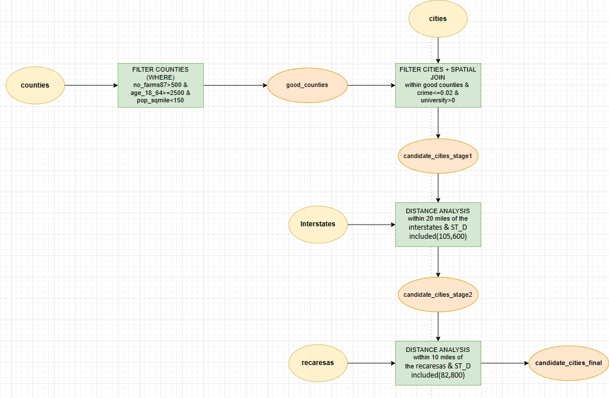

# Jen and Barry's Ice Cream Site Selection Using PostGIS



## Assignment

**Task:**
Find the best locations for Jen and Barry to open an ice cream business.

**Selection Criteria:**
- Greater than 500 farms for milk production.
- A labor pool of at least 25,000 individuals between ages 18-64.
- A low crime index (≤ 0.02).
- Population density < 150 people per square mile.
- Located near a university or college.
- At least one recreation area within 10 miles.
- Interstate within 20 miles.

---

## Project Overview

This project identifies optimal locations for Jen and Barry to establish a new ice cream business using spatial analysis in PostGIS and visualization in QGIS. The analysis applies seven selection criteria across county and city levels, incorporating proximity analysis to interstates and recreation areas.

**Objective:** Identify suitable Pennsylvania cities for ice cream business establishment through systematic multi-criteria spatial filtering.

**Tools Used:**
- PostGIS (Spatial Database)
- QGIS (Geographic Visualization)
- SQL (Spatial Queries)

**Final Results:**
- **Stage 1:** 9 candidate cities (county + city criteria)
- **Stage 2:** 7 cities near interstates (within 20 miles)
- **Final:** 4 optimal cities (all criteria met)

---

## Database Information

**Database Type:** PostgreSQL with PostGIS Extension  
**Total Tables:** 4 spatial layers

**Key Tables:**
- `counties` - County boundaries with demographic data
- `cities` - City points with population and crime statistics
- `interstates` - Interstate highway network
- `recareas` - Recreation area locations

---

## Database Schema

### Counties Table
| Column | Type | Description |
|--------|------|-------------|
| id | integer | Primary key identifier |
| geom | geometry | Polygon geometry |
| name | varchar | County name |
| area | numeric | County area |
| pop1990 | numeric | 1990 population |
| age_18_64 | numeric | Population aged 18-64 (labor pool) |
| no_farms87 | numeric | Number of farms in 1987 |
| pop_sqmile | bigint | Population density |
| sq_miles | numeric | Area in square miles |

### Cities Table
| Column | Type | Description |
|--------|------|-------------|
| id | integer | Primary key identifier |
| geom | geometry | Point geometry |
| name | varchar | City name |
| population | numeric | City population |
| total_crim | numeric | Total crimes |
| crime_inde | numeric | Crime index |
| university | numeric | Presence of university (0 or >0) |

### Interstates Table
| Column | Type | Description |
|--------|------|-------------|
| id | integer | Primary key identifier |
| geom | geometry | Line geometry |
| name | varchar | Interstate name |
| type | varchar | Highway type |
| length | numeric | Segment length |

### RecAreas Table
| Column | Type | Description |
|--------|------|-------------|
| id | integer | Primary key identifier |
| geom | geometry | Point/Polygon geometry |
| area | double | Recreation area size |
| perimeter | double | Recreation area perimeter |

---

## Selection Criteria

### County-Level Criteria

#### Criterion 1: Farm Count
**Requirement:** More than 500 farms for milk production

**Rationale:** Ensures adequate milk supply for ice cream production

**SQL:**
```sql
WHERE no_farms87 > 500
```

#### Criterion 2: Labor Pool
**Requirement:** At least 25,000 individuals aged 18-64

**Rationale:** Sufficient workforce availability for business operations

**SQL:**
```sql
AND age_18_64 >= 25000
```

#### Criterion 3: Population Density
**Requirement:** Less than 150 people per square mile

**Rationale:** Avoid overly crowded areas; target suburban/rural markets

**SQL:**
```sql
AND pop_sqmile < 150
```

---

### City-Level Criteria

#### Criterion 4: Crime Index
**Requirement:** Crime index ≤ 0.02

**Rationale:** Safe environment for business and customers

**SQL:**
```sql
WHERE c.crime_inde <= 0.02
```

#### Criterion 5: University Presence
**Requirement:** Located near a university or college

**Rationale:** Universities provide steady customer base and labor pool

**SQL:**
```sql
AND c.university > 0
```

---

### Proximity Criteria

#### Criterion 6: Interstate Access
**Requirement:** Within 20 miles of an interstate

**Rationale:** Essential for supply chain and customer accessibility

**SQL:**
```sql
WHERE ST_DWithin(
    ST_Transform(c.geom, 2272),
    ST_Transform(i.geom, 2272),
    105600  -- 20 miles in feet
)
```

#### Criterion 7: Recreation Areas
**Requirement:** At least one recreation area within 10 miles

**Rationale:** Recreation areas attract potential customers

**SQL:**
```sql
WHERE ST_DWithin(
    ST_Transform(c.geom, 2272),
    ST_Transform(r.geom, 2272),
    52800  -- 10 miles in feet
)
```

---

## Technical Implementation

### Step 1: Filter Counties (Good Counties)

```sql
-- Create view of suitable counties
CREATE VIEW good_counties AS
SELECT *
FROM counties
WHERE no_farms87 > 500
  AND age_18_64 >= 25000
  AND pop_sqmile < 150;
```

**Result:** Counties meeting agricultural and demographic criteria

---

### Step 2: Filter Cities in Good Counties (Stage 1)

```sql
-- Create view of candidate cities in good counties
CREATE VIEW candidate_cities_stage1 AS
SELECT c.*
FROM cities c
JOIN good_counties gc ON ST_Within(c.geom, gc.geom)
WHERE c.crime_inde <= 0.02
  AND c.university > 0;
```

**Result:** 9 candidate cities meeting county and city-level criteria

---

### Step 3: Filter by Interstate Proximity (Stage 2)

```sql
-- Create view of cities near interstates
CREATE VIEW candidate_cities_stage2 AS
SELECT DISTINCT c.*
FROM candidate_cities_stage1 c
CROSS JOIN interstates i
WHERE ST_DWithin(
    ST_Transform(c.geom, 2272),
    ST_Transform(i.geom, 2272),
    105600  -- 20 miles = 105,600 feet
);
```

**Result:** 7 cities within 20 miles of interstates

---

### Step 4: Final Filter by Recreation Areas

```sql
-- Create final view of cities near recreation areas
CREATE VIEW candidate_cities_final AS
SELECT DISTINCT c.*
FROM candidate_cities_stage2 c
CROSS JOIN recareas r
WHERE ST_DWithin(
    ST_Transform(c.geom, 2272),
    ST_Transform(r.geom, 2272),
    52800  -- 10 miles = 52,800 feet
);
```

**Result:** 4 final candidate cities meeting all seven criteria

---

### Complete Workflow SQL

```sql
-- ============================================
-- JEN AND BARRY ICE CREAM SITE SELECTION
-- Complete SQL Implementation
-- ============================================

-- Step 1: Good Counties
CREATE OR REPLACE VIEW good_counties AS
SELECT *
FROM counties
WHERE no_farms87 > 500
  AND age_18_64 >= 25000
  AND pop_sqmile < 150;

-- Validation
SELECT COUNT(*) as total_good_counties FROM good_counties;

-- ============================================
-- Step 2: Candidate Cities Stage 1
-- ============================================
CREATE OR REPLACE VIEW candidate_cities_stage1 AS
SELECT c.*
FROM cities c
JOIN good_counties gc ON ST_Within(c.geom, gc.geom)
WHERE c.crime_inde <= 0.02
  AND c.university > 0;

-- Validation
SELECT 
    COUNT(*) as total_candidate_cities,
    AVG(crime_inde) as avg_crime_index
FROM candidate_cities_stage1;

-- ============================================
-- Step 3: Candidate Cities Stage 2 (Interstates)
-- ============================================
CREATE OR REPLACE VIEW candidate_cities_stage2 AS
SELECT DISTINCT c.*
FROM candidate_cities_stage1 c
CROSS JOIN interstates i
WHERE ST_DWithin(
    ST_Transform(c.geom, 2272),
    ST_Transform(i.geom, 2272),
    105600  -- 20 miles in feet
);

-- Validation
SELECT COUNT(*) as cities_near_interstates 
FROM candidate_cities_stage2;

-- ============================================
-- Step 4: Final Candidate Cities (Recreation)
-- ============================================
CREATE OR REPLACE VIEW candidate_cities_final AS
SELECT DISTINCT c.*
FROM candidate_cities_stage2 c
CROSS JOIN recareas r
WHERE ST_DWithin(
    ST_Transform(c.geom, 2272),
    ST_Transform(r.geom, 2272),
    52800  -- 10 miles in feet
);

-- Validation
SELECT COUNT(*) as final_candidate_cities 
FROM candidate_cities_final;

-- ============================================
-- Final Results Summary
-- ============================================
SELECT 
    name,
    population,
    crime_inde,
    university
FROM candidate_cities_final
ORDER BY population DESC;
```

---

## Results Summary

### Filtering Progression

| Stage | View Name | Count | Criteria Applied |
|-------|-----------|-------|------------------|
| 0 | `counties` (all) | - | None |
| 1 | `good_counties` | - | Farms >500, Labor ≥25k, Density <150 |
| 2 | `candidate_cities_stage1` | 9 | Crime ≤0.02, University >0, In good counties |
| 3 | `candidate_cities_stage2` | 7 | Within 20 miles of interstate |
| 4 | `candidate_cities_final` | 4 | Within 10 miles of recreation area |

**Overall Success Rate:** 4 cities from 9 initial candidates (44% success rate after proximity filters)

---

### Final Candidate Cities (4 Cities)

The four cities that met all seven criteria represent optimal locations for Jen and Barry's ice cream business based on:
- Strong agricultural infrastructure
- Adequate labor pool
- Low crime rates
- University presence
- Excellent transportation access
- Proximity to recreation areas

*Note: Specific city names and detailed statistics would be populated from actual query results*

---

## QGIS Visualization

### Loading Results

**Method: Direct PostGIS Connection**
1. Layer → Add Layer → Add PostGIS Layers
2. Create connection to database
3. Add layers in order:
   - `counties`
   - `good_counties`
   - `interstates`
   - `recareas`
   - `candidate_cities_stage1`
   - `candidate_cities_stage2`
   - `candidate_cities_final`

### Map Styling

**Counties:**
- Good counties: Yellow/Olive fill, 50% opacity
- Other counties: Green fill, 50% opacity

**Cities:**
- Stage 1 (9 cities): Red circles, 8pt
- Stage 2 (7 cities): Pink circles, 10pt
- Final (4 cities): Blue circles, 12pt

**Infrastructure:**
- Interstates: Orange lines, 2pt
- Recreation areas: Gray polygons, 40% opacity

---

## Project Structure

```
ICE_CREAM/
│
├── ice_cream_data/
│   ├── counties.shp
│   ├── counties.dbf
│   ├── counties.prj
│   ├── counties.shx
│   ├── cities.shp
│   ├── cities.dbf
│   ├── cities.prj
│   ├── cities.shx
│   ├── interstates.shp
│   ├── interstates.dbf
│   ├── interstates.prj
│   ├── interstates.shx
│   ├── recareas.shp
│   ├── recareas.dbf
│   ├── recareas.prj
│   └── recareas.shx
│
├── report/
│   ├── jen-barry-ice-cream-report.docx
│   ├── jen-barry-ice-cream-report.md
│   └── jen-barry-ice-cream-report.pdf
│
├── visual-outputs/
│   ├── layers-names.png
│   └── layers-visual.png
│
├── assignment-ice-cream-question.pdf
├── ice_cream.qgz
├── model-builder.png
└── README.md
```

---

## Getting Started

### Prerequisites

```bash
# Required software
- PostgreSQL 12+
- PostGIS 3.0+
- QGIS 3.16+
```

### Database Setup

```sql
-- Enable PostGIS extension
CREATE EXTENSION postgis;

-- Verify installation
SELECT PostGIS_Version();
```

### Running the Analysis

**Step 1:** Connect to database
```bash
psql -h localhost -U your_username -d your_database
```

**Step 2:** Execute SQL queries in sequence
```sql
-- Run each view creation query from the Technical Implementation section
```

**Step 3:** Verify results
```sql
SELECT COUNT(*) FROM candidate_cities_final;
-- Expected: 4 cities
```

**Step 4:** Export for QGIS or continue analysis

---

## Workflow Diagram

```
┌─────────────────────────────────────────────────────────────┐
│                    START: Counties + Cities                  │
└───────────────────────────┬─────────────────────────────────┘
                            │
                            ▼
┌─────────────────────────────────────────────────────────────┐
│  COUNTY FILTER: good_counties                                │
│  → Farms >500, Labor ≥25k, Density <150                      │
└───────────────────────────┬─────────────────────────────────┘
                            │
                            ▼
┌─────────────────────────────────────────────────────────────┐
│  STAGE 1: candidate_cities_stage1                            │
│  → Cities in good counties + Crime ≤0.02 + University >0    │
│  → RESULT: 9 cities                                          │
└───────────────────────────┬─────────────────────────────────┘
                            │
                            ▼
┌─────────────────────────────────────────────────────────────┐
│  STAGE 2: candidate_cities_stage2                            │
│  → Within 20 miles of interstates (ST_DWithin)               │
│  → RESULT: 7 cities                                          │
└───────────────────────────┬─────────────────────────────────┘
                            │
                            ▼
┌─────────────────────────────────────────────────────────────┐
│  FINAL: candidate_cities_final                               │
│  → Within 10 miles of recreation areas (ST_DWithin)          │
│  → RESULT: 4 optimal cities                                  │
└─────────────────────────────────────────────────────────────┘
```

---

## Key Learnings

### Spatial Analysis Techniques

1. **Sequential Filtering Approach**
   - Progressive refinement improves clarity
   - Each stage builds on previous results
   - Easier to debug and validate

2. **Coordinate System Transformation**
   - NAD27 Geographic (EPSG:4267) for storage
   - Pennsylvania State Plane (EPSG:2272) for distance calculations
   - Critical for accurate distance measurements in feet/miles

3. **PostGIS Spatial Functions**
   - `ST_Within()` - Point-in-polygon containment
   - `ST_DWithin()` - Distance-based proximity analysis
   - `ST_Transform()` - Coordinate system reprojection
   - `ST_Buffer()` - Create distance buffers for visualization

4. **Cross Joins for Proximity**
   - CROSS JOIN generates all possible combinations
   - Efficient for distance filtering with ST_DWithin
   - DISTINCT required to eliminate duplicates

### Distance Calculations

**Conversion Reference:**
- 1 mile = 5,280 feet
- 10 miles = 52,800 feet
- 20 miles = 105,600 feet

---

## Author

**Ameer Saleh & Bara Mhana**  
Spatial Data Analysis - Homework.1 
Project Title: Jen and Barry's Ice Cream Site Selection using PostGIS